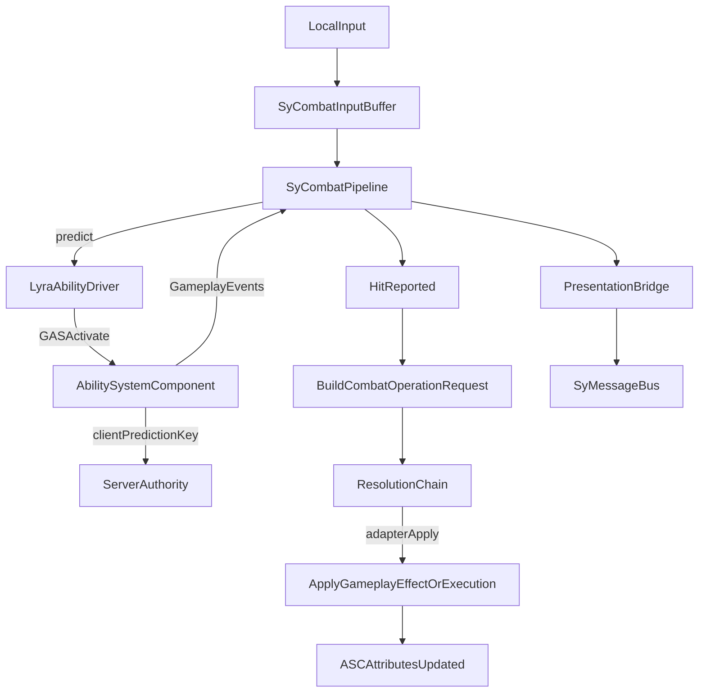

# SyCombat（GAS/Lyra 适配）完整可用方案与重构规划

## 目标与约束

- **目标**：搭建一套“流程编排为核心”的通用战斗管线（ARPG），把输入/技能/判定/结算/表现/AI 的信息流收口到 SyCombat 下；重度逻辑放在 Adapter/Impl（Lyra/GAS 为首个 Adapter）。
- **约束**：
  - `SyCore` **不依赖** `GameplayAbilities`（你选择了 `combat_module_only`）。
  - 初期 **多人 + 客户端预测**（你选择了 `mp_with_prediction`），因此必须遵循 GAS 的 Prediction/Authority 范式。
  - `ISyCombatEntity` 等 combat 接口放在 `SyCombat`，但使用方式要贯彻 `USyEntityComponent` 作为统一聚合入口。

## 现状关键信息（用于对照）

- `USyIdentityComponent` 已提供 **EntityId/Alias/Tags**，并由 `USyEntityRegistry` 做 **EntityId->EntityComponent** 索引：
  - [`SyCore/Source/SyCore/Public/Entity/SyIdentityComponent.h`](SyCore/Source/SyCore/Public/Entity/SyIdentityComponent.h)
  - [`SyCore/Source/SyCore/Public/Entity/SyEntityRegistry.h`](SyCore/Source/SyCore/Public/Entity/SyEntityRegistry.h)
- 现有 State 链路更偏“通用 KV + 覆盖/列表聚合”，按 `TargetTypeTag` 做快照，不适合作为战斗高频数值主通道：
  - [`SyCore/Source/SyCore/Public/State/SyStateManagerSubsystem.h`](SyCore/Source/SyCore/Public/State/SyStateManagerSubsystem.h)
  - [`SyCore/Source/SyCore/Private/State/StateContainerTypes.cpp`](SyCore/Source/SyCore/Private/State/StateContainerTypes.cpp)
- MessageBus 已具备按类型订阅与队列优先级，适合作为 **PresentationBridge / Tag-Driven Event**：
  - [`SyCore/Source/SyCore/Public/Messaging/SyMessageBus.h`](SyCore/Source/SyCore/Public/Messaging/SyMessageBus.h)

## SyCore 重构规划（甩掉历史包袱：唯一入口、最大兼容、预测友好）

### 设计原则（你要求的“唯一入口”如何达成）

- **唯一入口**：所有“读/写状态”都从 `USyEntityComponent` 进入，暴露一个统一 Facade（例如 `USyEntityStateFacadeComponent`）。
  - 上层系统（任务/关卡/AI/交互/SyCombat）只依赖 Facade API，不直接碰 `USyStateComponent`/`USyStateManagerSubsystem`/ASC
  - Facade 内部再路由到不同的 **Backends**（Generic、GAS、未来自研 Numeric）
- **最大兼容**：保留你们现有 Generic State（TagMetadata + `FInstancedStruct`）作为“低频/可配置”通道；把高频战斗数值交给 GAS（per-entity）
- **预测友好**：所有会影响能力可用性/表现的关键状态，都必须能以 GAS 的方式在客户端预测并被服务器权威校正
- **快速甩包袱**：禁止新系统继续依赖 `EntityTags.First()` 作为语义关键值；逐步把“类型Tag/配置Tag”与“实体唯一标识”彻底分离。

### SyCore：新增/重整的核心对象（建议命名）

- **`USyEntityStateFacadeComponent`（SyCore，唯一入口）**
  - **Query**：`GetTags()` / `HasTag()` / `GetNumeric()` / `GetStruct()`
  - **Apply**：`ApplyStateChange(Request)`（携带 TargetEntityId、Scope、OpType、PredictionPolicy）
  - **Events**：`OnStateChanged(Delta)`（统一对外广播）
- **`ISyStateBackend`（SyCore，非 GAS 依赖）**
  - **语义**：存取后端；不要求实现算术（算术与规则处理放到 Processor/Adapter）
  - **最小集合**：Tag 通道 + Numeric 通道 + Generic Struct 通道
- **`SyStateService`（建议做成 Subsystem，SyCore）**
  - **职责**：把 Facade 的 Apply 请求路由到一个或多个后端，并产生 Delta
  - **可扩展**：后续接入“State Processing/Validation/权限/回滚”链

### GAS AbilitySet/状态同步：推荐“Effect 优先 + LooseTag 辅助”的双通道

你提到“全局状态更新到 AbilitySetImpl 上时会 warp 成一个 Effect？”——**结论：对多人预测与一致性，默认应让关键状态以 GameplayEffect/GrantedTags 的形式进入 ASC。**

- **长期稳定策略（推荐默认）**
  - **状态 -> GameplayEffect（GrantedTags / Modifiers）**：
    - Phase、Dead、Stun、SuperArmor、WeaponMode 等“影响可用性/判定/动画分支”的关键状态，用一个或多个 GE 来表达
    - 好处：复制与回滚由 GAS 处理，Lyra 生态兼容度最高
  - **AbilitySet 不做频繁动态改写**：
    - 初期优先采用“能力预授予 + Tag Gate（ActivationRequired/BlockedTags）”
    - 状态变化只需要改变 Tags（通过 GE），能力可用性自动联动

- **预测辅助策略（用于即时反馈）**
  - 客户端可临时用 **ASC LooseTags** 做“立刻生效”的预测表现（例如 InputBuffer 触发的瞬时窗口 Tag）
  - 服务器权威最终以 GE 为准，必要时清理/对齐 loose tags

- **落地形式（不污染 SyCore）**
  - 新增可选插件 **`SyGASBridge`**（或并入 `SyCombatLyraAdapter`）：
    - 实现一个 `ISyStateBackend` 的 GAS 版本（内部持有 `UAbilitySystemComponent*`）
    - 把 Facade 的 Delta 映射为：
      - `ApplyGameplayEffectToSelf`（服务器权威 + 可预测）
      - `AddLooseGameplayTag/RemoveLooseGameplayTag`（客户端即时）
      - Attribute 修改（优先通过 GE 修饰器）
    - 提供 DataAsset `USyStateToGASMapping`：声明哪些 Sy 状态 Tag 映射到哪些 GAS Tag/GE/Attribute

### StateManager（现有实现）如何定位与迁移（避免拖慢进度）

- **定位**：`USyStateManagerSubsystem` 继续服务“低频、可存档、全局/按类型”的状态（任务、关卡、交互配置），不承担战斗数值主路径
- **迁移**：
  - Facade 对上提供同一套 Apply API，但内部按 `Scope` 选择：
    - `EntityScope`：走 GAS Backend（优先）或未来 Numeric Backend
    - `WorldScope/TypeScope`：走现有 StateManager（保留）
  - 这样任务系统“设置敌人转阶段/死亡”依旧走唯一入口：
    - 如果目标是某个敌人实体：`EntityScope + TargetEntityId` -> GAS（通过 GE granting tags）
    - 如果是全局规则：`WorldScope` -> StateManager

### EntityRegistry：更有效索引（你提到的“更快查找”和“别背历史包袱”）

现状里 `GetEntitiesByTag` 仍在扫描 `EntityIdMap`，而 `EntityTagMap` 只对 exact 使用。

- **改造目标**
  - 注册时把实体的每个 Tag 以及其 **父 Tag** 都写入索引（满足“HasTag”语义）
  - 增加 `Alias -> EntityId` 索引（用于关卡/任务配置引用）
  - 保持 `EntityId -> EntityComponent` 作为唯一权威入口
- **接口建议**
  - `GetEntityById(FGuid)`（权威）
  - `GetEntityByAlias(FName)`（便于配置）
  - `GetEntitiesByTag(FGameplayTag)`（O(1) 索引命中，包含父Tag语义）
  - `GetEntitiesByTagExact(FGameplayTag)`（精确）
  - 可选：`GetEntitiesByQuery(FGameplayTagQuery)`（后续再做，避免早期过度设计）

### SyPlugins “彻底重构目标”（对齐你的诉求：尽快不被历史拖慢）

- **明确“快路径 vs 慢路径”**
  - 快路径（战斗/预测/高频）：GAS/ASC/Attributes/GE
  - 慢路径（任务/关卡/配置）：TagMetadata + `FInstancedStruct`
- **消灭隐式约定**：不再把 `EntityTags.First()` 当成类型/目标语义的唯一来源
- **唯一入口**：所有系统只能通过 `USyEntityComponent` 访问状态/事件/战斗 facet
- **模块边界更硬**：SyCore 保持无业务、无 GAS；业务与重逻辑都在 Adapter/Impl

## 总体架构（建议落地形态）

### 模块/插件划分

- **新增插件 `SyCombat`（核心管线，不依赖 GAS）**
  - 定义：战斗域模型、流程状态机、可插拔接口、统一事件（tag-driven），以及“处理链”抽象（但不实现 Lyra/GAS 细节）。
  - 依赖：`SyCore`、`GameplayTags`、`StructUtils`（可选）、`AIModule`（可选，若需要感知/AI接口）。
- **新增插件 `SyCombatLyraAdapter`（重度逻辑，依赖 GAS + Lyra）**
  - 实现：GAS Ability 驱动、TargetData、GameplayEffect/Execution、Lyra 输入/能力集接入、GameplayCue/镜头表现桥。
  - 依赖：`SyCombat`、`GameplayAbilities`/`GameplayTasks`/`GameplayTags`、以及 Lyra 对应模块。

### 核心数据流（预测友好）

- **预测策略**：
  - 客户端：InputBuffer 触发 pipeline，pipeline 通过 adapter 调用 GAS 预测激活（带 PredictionKey）。
  - 服务器：权威执行/应用 GE；必要时通过 GAS 自带回滚/校正。
  - SyCombat core 不“算数值”，只负责：生命周期、上下文收集、处理链调用顺序、调试 trace、对外事件。

## 需要“仔细解耦/改口径”的既有点（不强制全改，但要明确边界）

- **StateManager 的 key 语义**：当前聚合/订阅按 `TargetTypeTag`，且 `USyStateComponent` 默认取“第一个 EntityTag”。这在战斗场景容易误用。
  - 规划：战斗数值走 GAS（per-entity）；SyCore StateManager 继续服务任务/关卡/交互等低频状态。
  - 中长期：若要让 StateManager 也支持 per-entity，可新增 `GetAggregatedModificationsByEntityId` 与按 EntityId 的订阅索引（不影响现有 API）。
- **Tag 作为“第一个元素”的隐式约定**：`USyMessageComponent`、`USyStateComponent::GetTargetTypeTag()` 都取 `EntityTags.First()`。
  - 规划：SyCombat 相关对象必须显式持有 `EntityId` 与必要的 `FGameplayTagContainer`，不依赖“First() 约定”。

## 实施路线图（按最小可验证 + 可扩展）

### Phase 1：创建 SyCombat 核心（不碰 Lyra/GAS 细节）

- 新增插件与模块骨架：
  - `SyCombat/SyCombat.uplugin`
  - `SyCombat/Source/SyCombat/SyCombat.Build.cs`
  - `SyCombat/Source/SyCombat/Public` & `Private`
- 定义核心接口（均在 SyCombat）：
  - `ISyCombatEntity`：通过 `USyEntityComponent` 统一入口拿到 combat 相关 facet（不要求 Actor 实现）。
  - `ISyCombatAbilityDriver`：抽象“激活能力/发送事件/接收回调”。
  - `ISyCombatPresentationBridge`：抽象表现事件输出（默认实现用 `USyMessageComponent` 发 tag-driven 消息）。
- 定义核心数据结构：
  - `FSyCombatActionRequest`（输入/AI 发起）
  - `FSyCombatActionContext`（source/target/entityId/tags/prediction info）
  - `FSyCombatHitContext`（hit result/instigator/target/entityId/impact tags）
  - `FSyCombatOperationRequest`（可变；携带 modifiers/context tags/trace；由 adapter 最终 apply）
- 新增核心组件（贯彻 SyEntityComponent 管理与初始化相位）：
  - `USyCombatEntityComponent`（实现 `ISyComponentInterface`；暴露“战斗实体 facet”）
  - `USyCombatPipelineComponent`（流程编排：接收 request、驱动 ability、收集 hit、触发 resolution chain、广播生命周期事件）
  - `USyCombatInputBufferComponent`（可选，初期可只支持 tag-based queue）

### Phase 2：创建 SyCombatLyraAdapter（打通 Lyra/GAS）

- 新增插件与模块骨架：
  - `SyCombatLyraAdapter/SyCombatLyraAdapter.uplugin`
  - `SyCombatLyraAdapter/Source/SyCombatLyraAdapter/SyCombatLyraAdapter.Build.cs`
- 实现 `ISyCombatAbilityDriver`：
  - 通过 ASC/Lyra Ability Set 进行 **预测激活**、基于 GameplayEvent 反馈 action 阶段（开始、取消、结束）。
  - 统一把 Lyra/GAS 的 TargetData/HitResult 转成 `FSyCombatHitContext` 回灌给 pipeline。
- 实现“Apply 适配”：
  - 把 `FSyCombatOperationRequest` 转成 `GameplayEffectSpecHandle` 或调用既有 Lyra Execution。
  - 保证：客户端预测表现（GameplayCue/本地反馈）与服务器权威应用一致。

### Phase 3：ResolutionChain（可插拔规则，但不把重逻辑塞进 core）

- 在 `SyCombat` 中定义 `ISyCombatProcessor`（priority + Process），并提供简单的 processor registry（可由 adapter 注册）。
- `SyCombatLyraAdapter` 提供默认 processors：
  - `BuildGESpecProcessor`（把 request 变成 GE spec）
  - `LyraDamageRuleProcessor`（复用/封装 Lyra 伤害规则）
  - `DebugTraceProcessor`（记录每步变化，输出到 log/visual logger）

### Phase 4：AI / 感知 / WorldState（可选，但接口先留）

- `SyCombat` 定义最小 AI 读取接口：
  - `ISyCombatWorldStateSource`（只读快照：距离、可用技能、关键 tags）
- `SyCombatLyraAdapter` 把 ASC tags、cooldown、targeting 信息映射为原子化 facts。

## 产出物（“完整可用”的判定标准）

- 在 Lyra 示例角色上：
  - 只需要挂 `USyEntityComponent` + `USyCombatEntityComponent` + `USyCombatPipelineComponent`（以及 LyraAdapter 组件/配置）。
  - 能从客户端输入触发 **预测技能**，服务器权威结算，命中后走 resolution chain，表现事件通过 MessageBus 广播。
- 给一套官方 Impl（在 adapter 内）：基础伤害、简单防御、Poise（可选）。
- 给一套可视化/日志调试：每次 action 的 request/processor trace/最终 apply 结果。

## 实施清单（含关键文件）

- 设计与接口：`SyCombat/Source/SyCombat/Public/Interfaces/*`
- 核心组件：`SyCombat/Source/SyCombat/Public/Components/*`
- Lyra 适配：`SyCombatLyraAdapter/Source/SyCombatLyraAdapter/Public/*`
- 与 SyCore 的连接点（不改依赖，只用现有能力）：
  - `USyEntityComponent`（通过 `FindSyComponent` 获取 combat facet）[`SyCore/Source/SyCore/Public/Entity/SyEntityComponent.h`](SyCore/Source/SyCore/Public/Entity/SyEntityComponent.h)
  - `USyEntityRegistry`（需要跨网络通过 EntityId 找目标时使用）[`SyCore/Source/SyCore/Public/Entity/SyEntityRegistry.h`](SyCore/Source/SyCore/Public/Entity/SyEntityRegistry.h)
  - `USyMessageBus`（表现桥默认实现）[`SyCore/Source/SyCore/Public/Messaging/SyMessageBus.h`](SyCore/Source/SyCore/Public/Messaging/SyMessageBus.h)

## 风险与对策

- **预测一致性**：必须把“权威 apply”完全交给 GAS/服务器；SyCombat 只做编排与上下文，避免自建一套与 GAS 冲突的预测模型。
- **隐式 FirstTag 约定**：战斗链路统一走 `EntityId` + 显式 tags，不复用 `TargetTypeTag` 快照。
- **性能**：core 层不做 UObject 状态频繁创建；数值全走 ASC。