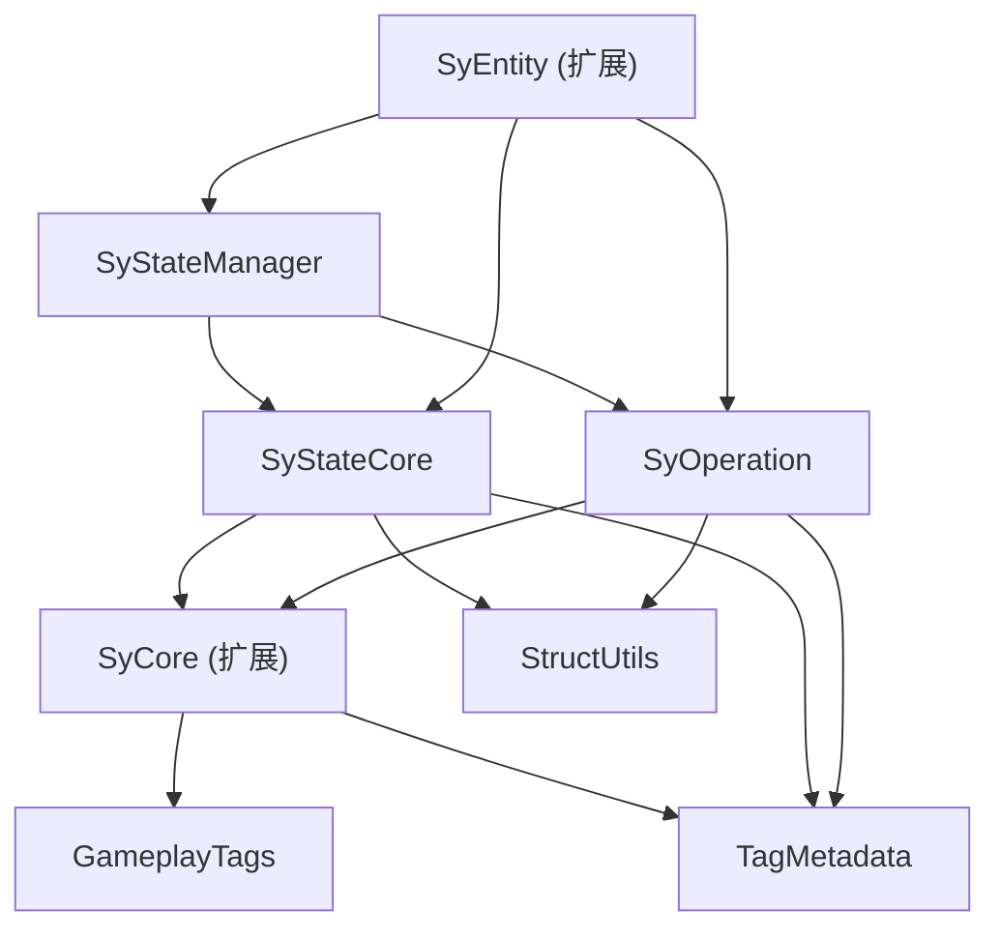

## SyPlugins - 高级状态管理系统设计文档

**版本:** 2.0
**日期:** 2025-04-06
**作者:** Gemini & Syan

---

### 1. 简介

#### 1.1 目标与愿景

本系统旨在为 SyPlugins 框架提供一个强大、灵活且数据驱动的状态管理解决方案。核心目标是建立一个以 **GameplayTag** 为核心标识，利用 **TagMetadata 插件** 定义数据结构 (Schema) 和承载实体状态，并由明确定义的 **操作 (Operation)** 驱动状态变更的架构。所有变更由中央 **状态管理器 (StateManager)** 进行协调和记录。

**关键设计原则:**

1.  **状态所有权**: `Entity` (通过 `USyStateComponent`) 拥有并维护其完整的最终运行时状态 (`FSyEntityState`)，状态数据由具体的 `UO_TagMetadata` 对象实例承载。
2.  **操作驱动**: 状态的改变源于定义良好的 `FSyOperation`，其 `Source`, `Modifier`, `Target` 均使用 `GameplayTag` 标识类型。
3.  **TagMetadata 核心**:
    *   **定义 Schema**: 利用 `TagMetadata` 插件（通过特定的 `UO_TagMetadata` 子类如 `USyOperationParamSchemaMetadata`）定义与操作标签 (Source/Modifier/Target Tag) 相关联的 **预期参数结构体 (USTRUCT) 类型**。
    *   **承载状态**: 利用 `TagMetadata` 插件（通过各种自定义的 `UO_TagMetadata` 子类如 `USyHealthMetadata`）**实例化对象**来存储和管理实体当前的具体状态数据。
4.  **结构化参数**: `FSyOperation` 的 `Source`, `Modifier`, `Target` 结构体使用 `FInstancedStruct` 携带 **运行时参数实例**，这些实例的结构类型由关联 Tag 的 Schema Metadata 指定。
5.  **数据驱动与配置化**: 实体的初始状态 (`InitData`) 和操作行为（参数结构）应高度可配置化，通过蓝图或数据资产定义。
6.  **主动同步**: `USyStateComponent` **主动**通过订阅或查询 `StateManager` 来获取状态修改记录 (`FSyStateModificationRecord`)，并据此更新自身持有的 `UO_TagMetadata` 状态对象。
7.  **可追溯性与扩展性**: 设计支持操作记录、状态历史查询、条件化操作等。
8.  **模块化**: 功能拆分为逻辑清晰、高内聚、低耦合的模块。

#### 1.2 核心概念图

*(需要更新图表以反映 Schema Metadata 查询和 FInstancedStruct 参数传递)*

 *(示意图路径)*

---

### 2. 核心概念详解

*   **Flow (流程)**: 代表游戏逻辑的执行单元，是 `Operation` 的发起者。
*   **GameplayTag (标签)**: 系统的核心标识符。用于识别 `Operation` 的 `Source/Modifier/Target` 类型，定义实体状态的 `Key`，以及通过 `TagMetadata` 系统关联 Schema 和状态定义。
*   **TagMetadata Plugin**: Unreal Engine 插件，允许将 `UO_TagMetadata` 对象实例与 `GameplayTag` 关联。在本系统中扮演双重角色：
    *   **Schema 定义**: 通过 `USyOperationParamSchemaMetadata` (或其他类似元数据类) 在 `UO_TagMetadataCollection` 中定义特定 `GameplayTag` (如 `Modifier.Damage.Physical`) 期望使用的**参数结构体类型** (如 `FDamageParams`)。
    *   **状态承载**: 通过自定义的 `UO_TagMetadata` 子类 (如 `USyHealthMetadata`) **实例化对象**，由 `USyStateComponent` 持有和管理，代表实体的具体运行时状态。
*   **`USyOperationParamSchemaMetadata`**: (需要创建的新类) 继承自 `UO_TagMetadata`，其核心作用是包含一个 `TSoftObjectPtr<UScriptStruct>` 成员，用于指向一个 `USTRUCT` 类型。在 `TagMetadataCollection` 中将操作相关的 Tag 与此元数据关联，即可定义该操作 Tag 的参数 Schema。此元数据不仅在运行时用于指导参数实例化，还在编辑器自定义中扮演关键角色，用于确定与特定 Tag 相关联的操作应使用哪种参数结构体，从而提升配置时的类型安全性和用户体验。
*   **Parameter Struct (参数结构体 - USTRUCT)**: 定义各种操作所需参数的具体 C++ `USTRUCT` (如 `FDamageParams`, `FApplyStatusParams`)。这些结构体可以包含任意 `UPROPERTY`。
*   **Operation (操作 - `FSyOperation`)**: 定义一个完整的状态变更意图。包含：
    *   **Source (`FSyOperationSource`)**: 包含 `SourceTypeTag` (标识来源类型) 和一个 `FInstancedStruct Parameters` (携带由 `SourceTypeTag` 的 Schema Metadata 定义的结构体实例，包含来源上下文参数，如 `FInteractionSourceParams`)。
    *   **Modifier (`FSyOperationModifier`)**: 包含 `ModifierTag` (标识修改类型) 和一个 `FInstancedStruct Parameters` (携带由 `ModifierTag` 的 Schema Metadata 定义的结构体实例，包含修改的具体参数，如 `FDamageParams`)。
    *   **Target (`FSyOperationTarget`)**: 包含 `TargetTypeTag` (标识目标类型) 和一个 `FInstancedStruct Parameters` (可选，携带由 `TargetTypeTag` 的 Schema Metadata 定义的结构体实例)，通常还包含一个明确的 `FGuid TargetEntityId`。
*   **`FInstancedStruct`**: UE 结构体，可在运行时持有任意 `USTRUCT` 的实例。在此系统中用于：
    *   在 `FSyOperation` 的 `Source/Modifier/Target` 中携带**运行时参数实例**。
    *   在 `FSyEntityInitData` 中携带**初始化参数结构体实例**。
    *   **编辑器挑战与解决方案**: 在编辑器中直接使用 `FInstancedStruct` 时，其类型选择器默认允许选择任何 `USTRUCT`。为了实现在 `FSyOperation` 中，当 `ModifierTag` (或其他定义性 Tag) 改变时，自动更新或验证 `Parameters` (`FInstancedStruct`) 的结构体类型，需要进行编辑器自定义。这通常通过重写 `PostEditChangeProperty` 或实现 `IDetailCustomization` 来完成，其核心逻辑是查询 Tag 关联的 `USyOperationParamSchemaMetadata` 来确定正确的结构体类型。
*   **StateManager (`USyStateManager`)**:
    *   **职责**: 接收 `Operation`，记录状态修饰操作 (`FSyStateModificationRecord`)。提供查询接口或事件广播机制供 `USyStateComponent` 获取变更。**不直接修改实体状态**。
    *   **状态存储**: 存储 `FSyStateModificationRecord` 列表。
    *   **实现**: `UGameInstanceSubsystem` 或 `UWorldSubsystem`。
*   **Entity (实体)**: 游戏世界对象 (Actor)，通过 `USyStateComponent` 管理状态。
*   **USyStateComponent (状态组件)**:
    *   **职责**: 管理所属 `Entity` 的 `FSyEntityState` (即 `UO_TagMetadata` 状态对象实例)。**主动**查询或订阅 `StateManager` 获取 `FSyStateModificationRecord`，解析其中的参数并更新自身状态对象。
    *   **更新逻辑**: 组件内部负责根据 `Record` 中的信息查找并修改对应的 `UO_TagMetadata` 实例，或创建/销毁实例。
*   **EntityState (`FSyEntityState`)**:
    *   **职责**: `USyStateComponent` 内部持有的、代表实体当前完整状态的数据集合。
    *   **实现**: 核心是 `TMap<FGameplayTag, TArray<TObjectPtr<UO_TagMetadata>>>`。一个 `GameplayTag` (如 `State.Buffs`) 可以关联零个或多个代表状态的 `UO_TagMetadata` 对象实例 (如多个 `USyStatusEffectMetadata` 实例)。
*   **InitData (`FSyEntityInitData`)**:
    *   **职责**: 定义 `Entity` 初始化时的基础状态配置。
    *   **实现**: 包含 `TMap<FGameplayTag, TArray<FInstancedStruct>> InitialState`。`FInstancedStruct` 在这里存储的是**初始化参数结构体** (如 `FHealthInitParams`)。`USyStateComponent::InitializeState` 读取这些参数来创建初始的 `UO_TagMetadata` 状态对象实例。

---

### 3. 架构概览

系统数据流：

1.  **操作发起**: `Flow` 根据游戏逻辑，确定 `SourceTag`, `ModifierTag`, `TargetTag`。
2.  **Schema 查询 & 参数实例化**: `Flow` (或辅助类) 使用 `TagMetadata` 系统查询与 `Source/Modifier/Target Tag` 关联的 `USyOperationParamSchemaMetadata`，获取预期的参数结构体类型。
3.  **参数填充**: `Flow` 创建对应类型的 `FInstancedStruct`，并填充运行时参数。
4.  **构建 Operation**: 使用 Tags 和填充好的 `FInstancedStruct` 参数构建 `FSyOperation` 对象。
5.  **操作记录**: `Flow` 将 `FSyOperation` 提交给 `USyStateManager`。
6.  **记录与广播**: `USyStateManager` 创建 `FSyStateModificationRecord` (记录应用的操作参数) 并存储，然后广播通知。
7.  **状态同步**: `USyStateComponent` 通过查询或订阅 `StateManager` 获取与其相关的 `FSyStateModificationRecord`。
8.  **状态更新**: `USyStateComponent` 解析 `Record` 中的 `ModifierTag` 和 `Parameters` (`FInstancedStruct`)，查找/创建/修改自身 `FSyEntityState` 中对应的 `UO_TagMetadata` 对象实例。
9.  **初始化**: `Entity` 初始化时，`USyStateComponent` 读取 `InitData` 中的 `InitialState` (`TMap<Tag, TArray<FInstancedStruct>>`)，根据初始化参数创建初始的 `UO_TagMetadata` 状态对象实例存入 `FSyEntityState`。

---

### 4. 模块化实现方案

(需要根据最终代码结构调整)

1.  **SyCore (扩展)**
    *   **内容**: 基础 GameplayTag 定义。可能包含 TagMetadata 插件的集成基类或接口（如果需要统一管理）。
    *   **依赖**: `GameplayTags`, `TagMetadata`

2.  **SyStateCore**
    *   **内容**: 核心状态相关的非操作数据结构和定义。
    *   **关键类型**: `FSyEntityState`, `FSyEntityInitData`, 各种 `UO_TagMetadata` 状态子类定义 (如 `USyHealthMetadata`)，可能包含状态访问的 Helper 函数/接口。
    *   **依赖**: `SyCore`, `TagMetadata`, `StructUtils`

3.  **SyOperation**
    *   **内容**: 操作相关的定义和 Schema 元数据。
    *   **关键类型**: `FSyOperationSource`, `FSyOperationModifier`, `FSyOperationTarget`, `FSyOperation`, 各种操作参数 `USTRUCT` (如 `FDamageParams`)，`USyOperationParamSchemaMetadata`。
    *   **依赖**: `SyCore`, `TagMetadata`, `StructUtils`

4.  **SyStateManager**
    *   **内容**: 状态管理器的核心实现。
    *   **关键类型**: `USyStateManager` (Subsystem), `FSyStateModificationRecord`。查询接口和事件广播。
    *   **依赖**: `SyOperation`, `SyStateCore` (可能需要EntityID等)

5.  **SyEntity (扩展)**
    *   **内容**: 实体端状态管理的实现。
    *   **关键类型**: `USyStateComponent`。
    *   **依赖**: `SyStateCore`, `SyStateManager`, `SyOperation` (处理Record)



---

### 5. 关键数据结构 (示例)

```cpp
// --- SyStateCore Module ---

// 实体状态集合
USTRUCT(BlueprintType)
struct SYSTATECORE_API FSyEntityState
{
    GENERATED_BODY()

    // 核心状态存储: Tag -> UO_TagMetadata 实例数组
    UPROPERTY(VisibleAnywhere, BlueprintReadOnly, Category="State", Transient) // Transient if dynamically created/managed
    TMap<FGameplayTag, TArray<TObjectPtr<UO_TagMetadata>>> StateData;

    // TODO: Add Helper functions for safe access (e.g., FindFirstMetadataOfType<T>, GetAllMetadataOfType<T>)
};

// 实体初始化数据
USTRUCT(BlueprintType)
struct SYSTATECORE_API FSyEntityInitData
{
    GENERATED_BODY()

    // 使用 FInstancedStruct 存储初始化参数结构体实例
    UPROPERTY(EditAnywhere, BlueprintReadWrite, Category="Initialization", meta=(BaseStruct="/Script/CoreUObject.Object"))
    TMap<FGameplayTag, TArray<FInstancedStruct>> InitialState;
};

// --- Example State UO_TagMetadata Subclass ---
UCLASS(Blueprintable) // Allow BP subclasses for state data
class SYSTATECORE_API USyHealthMetadata : public UO_TagMetadata
{
    GENERATED_BODY()
public:
    UPROPERTY(EditAnywhere, BlueprintReadWrite, Category="Health")
    float MaxHealth = 100.f;
    UPROPERTY(VisibleAnywhere, BlueprintReadWrite, Category="Health") // Current health likely runtime only
    float CurrentHealth = 100.f;
    // ... other health related properties
};

// --- SyOperation Module ---

// --- Example Parameter USTRUCTs ---
USTRUCT(BlueprintType) struct FDamageParams { GENERATED_BODY() /* ... */ };
USTRUCT(BlueprintType) struct FApplyStatusParams { GENERATED_BODY() /* ... */ };
USTRUCT(BlueprintType) struct FInteractionSourceParams { GENERATED_BODY() /* ... */ };

// Schema Definition Metadata Class
UCLASS()
class SYOPERATION_API USyOperationParamSchemaMetadata : public UO_TagMetadata
{
    GENERATED_BODY()
public:
    UPROPERTY(EditAnywhere, BlueprintReadWrite, Category="Schema", meta = (AllowAbstract = "false", MetaClass = "/Script/CoreUObject.ScriptStruct"))
    TSoftClassPtr<UObject> ParameterStructType; // Use TSoftClassPtr<UObject> and filter for UScriptStruct in editor/validation
};

// Operation Sub-Structs using FInstancedStruct
USTRUCT(BlueprintType)
struct SYOPERATION_API FSyOperationModifier
{
    GENERATED_BODY()
    UPROPERTY(EditAnywhere, BlueprintReadWrite) FGameplayTag ModifierTag;
    UPROPERTY(EditAnywhere, BlueprintReadWrite, Category="Parameters", meta = (BaseStruct="/Script/CoreUObject.Object"))
    FInstancedStruct Parameters;
    
    // 编辑器注意: 为了在编辑器中根据 ModifierTag 动态更新 Parameters 的结构体类型，
    // 需要实现编辑器自定义逻辑 (例如 PostEditChangeProperty 或 IDetailCustomization)。
    // 否则，用户需要手动确保 Parameters 的类型与 ModifierTag 所定义的 Schema 一致。
};

USTRUCT(BlueprintType)
struct SYOPERATION_API FSyOperationSource { /* Tag + Parameters FInstancedStruct */ };
USTRUCT(BlueprintType)
struct SYOPERATION_API FSyOperationTarget { /* Tag + Parameters FInstancedStruct + TargetEntityId */ };

// Full Operation Struct
USTRUCT(BlueprintType)
struct SYOPERATION_API FSyOperation { /* Source, Modifier, Target, OperationId */ };

// --- SyStateManager Module ---

// State Modification Record
USTRUCT()
struct SYSTATEMANAGER_API FSyStateModificationRecord
{
    GENERATED_BODY()
    UPROPERTY() FGuid RecordId;
    UPROPERTY() FGuid OperationId;
    UPROPERTY() FGuid TargetEntityId;
    UPROPERTY() FGameplayTag ModifierTag;
    // Record the parameters applied using FInstancedStruct, mirroring the Modifier
    UPROPERTY() FInstancedStruct ParametersApplied;
    UPROPERTY() FDateTime Timestamp;
};
```

---

### 6. 关键接口与类 (示例)

```cpp
// --- SyStateManager Module ---
UCLASS()
class SYSTATEMANAGER_API USyStateManager : public UGameInstanceSubsystem
{
    GENERATED_BODY()
public:
    UFUNCTION(BlueprintCallable, Category="State Management")
    bool RecordOperation(const FSyOperation& Operation);

    UFUNCTION(BlueprintPure, Category="State Management")
    TArray<FSyStateModificationRecord> GetModificationsForEntity(const FGuid& TargetEntityId, const FGuid& SinceRecordId = FGuid()) const;

    DECLARE_DYNAMIC_MULTICAST_DELEGATE_OneParam(FOnStateModificationRecorded, const FSyStateModificationRecord&, NewRecord);
    UPROPERTY(BlueprintAssignable) FOnStateModificationRecorded OnStateModificationRecorded;
private:
    TArray<FSyStateModificationRecord> ModificationLog;
    void AddRecordAndBroadcast(const FSyStateModificationRecord& Record);
    bool ValidateAndProcessOperation(const FSyOperation& Operation, FSyStateModificationRecord& OutRecord);
};

// --- SyEntity Module ---
UCLASS(ClassGroup=(Custom), meta=(BlueprintSpawnableComponent))
class SYENTITY_API USyStateComponent : public UActorComponent
{
    GENERATED_BODY()
public:
    USyStateComponent();

    // Initialize state from InitData (creates UO_TagMetadata instances)
    UFUNCTION(BlueprintCallable, Category="State")
    virtual void InitializeState(const FSyEntityInitData& InitData);

    // Sync state changes from StateManager
    UFUNCTION(BlueprintCallable, Category="State")
    virtual void SyncStateFromManager();

    // --- State Accessors ---
    // Example: Get the first metadata object of a specific type for a given state tag
    template<typename T>
    T* FindFirstStateMetadata(FGameplayTag StateTag) const;

    // Example: Get all metadata objects of a specific type for a given state tag
    template<typename T>
    TArray<T*> GetAllStateMetadata(FGameplayTag StateTag) const;

    // Example: Add a runtime state metadata object (e.g., applying a new buff)
    UFUNCTION(BlueprintCallable, Category="State") // Maybe internal helper?
    void AddStateMetadata(FGameplayTag StateTag, UO_TagMetadata* MetadataInstance);

    // Example: Remove a runtime state metadata object
    UFUNCTION(BlueprintCallable, Category="State") // Maybe internal helper?
    bool RemoveStateMetadata(FGameplayTag StateTag, UO_TagMetadata* MetadataInstance);

    // Delegate broadcast when local state object property changes
    // (Requires individual UO_TagMetadata objects to broadcast their own changes, or a central dispatcher)
    // DECLARE_DYNAMIC_MULTICAST_DELEGATE(...);
    // UPROPERTY(BlueprintAssignable) ... OnLocalStateDataChanged;

protected:
    virtual void BeginPlay() override;
    virtual void EndPlay(const EEndPlayReason::Type EndPlayReason) override;

    // Process a single modification record received from StateManager
    virtual bool ApplyStateModification(const FSyStateModificationRecord& Record);

    // Helper to find or create UO_TagMetadata instances based on InitData FInstancedStruct
    UO_TagMetadata* CreateStateMetadataFromInitParam(FGameplayTag StateTag, const FInstancedStruct& InitParam);

    UPROPERTY(EditDefaultsOnly, Category="Initialization")
    FSyEntityInitData DefaultInitData;

    // The actual state data
    UPROPERTY(VisibleAnywhere, Category="State", Transient) // Transient if fully managed at runtime
    FSyEntityState CurrentState;

private:
    UPROPERTY() TObjectPtr<USyStateManager> StateManager;
    FGuid LastSyncedRecordId;
    FDelegateHandle StateManagerSubscriptionHandle;
    UFUNCTION() void HandleStateModificationRecorded(const FSyStateModificationRecord& NewRecord);
};
```

---

### 7. 工作流示例

#### 7.1 实体初始化

1.  在 Actor 蓝图中添加 `USyStateComponent`。
2.  配置 `DefaultInitData`:
    *   添加 Tag，如 `State.Health`。
    *   在该 Tag 的 `TArray<FInstancedStruct>` 中添加一个元素。
    *   设置该 `FInstancedStruct` 的类型为 `FHealthInitParams` (假设你创建了这样一个初始化参数结构体)。
    *   填充 `FHealthInitParams` 的值 (如 `MaxHealth = 150.f`)。
3.  在 `BeginPlay` (或适当的初始化点)，`USyStateComponent` 内部调用 `InitializeState(DefaultInitData)`。
4.  `InitializeState` 遍历 `InitData.InitialState`:
    *   对于 `State.Health` Tag 和 `FHealthInitParams` 实例。
    *   调用内部辅助函数 `CreateStateMetadataFromInitParam`。
    *   该函数 `NewObject<USyHealthMetadata>(this)` 创建一个 `USyHealthMetadata` 实例。
    *   使用 `FHealthInitParams` 中的数据设置 `USyHealthMetadata` 实例的属性 (`MaxHealth`, `CurrentHealth` 等)。
    *   将创建的 `USyHealthMetadata` 实例添加到 `CurrentState.StateData` 中，Key 为 `State.Health`。

#### 7.2 操作执行 (示例：施加燃烧伤害)

1.  **`Flow` (技能系统)**:
    *   确定 Tags: `SourceTag = Skill.Fireball`, `ModifierTag = Modifier.Damage.Burning`, `TargetTag = EntityType.Character`。
    *   确定目标: `TargetEntityId = SomeEnemyGUID`。
2.  **`Flow` (Schema 查询)**:
    *   查询 `Modifier.Damage.Burning` Tag 关联的 `USyOperationParamSchemaMetadata`。
    *   获取 `ParameterStructType` (应为 `FDamageParams` 或更具体的 `FBurningDamageParams`)。
3.  **`Flow` (参数实例化与填充)**:
    *   创建 `FInstancedStruct ModifierParams; ModifierParams.InitializeAs(FBurningDamageParams::StaticStruct());`
    *   获取指针 `FBurningDamageParams* ParamsPtr = ModifierParams.GetMutablePtr<FBurningDamageParams>();`
    *   填充参数 `ParamsPtr->DamagePerTick = 5.f; ParamsPtr->Duration = 10.f; ...`
    *   类似地，为 `Source` 和 `Target` (如果它们也有定义的参数结构) 创建并填充 `FInstancedStruct`。
4.  **`Flow` (构建 Operation)**:
    *   `FSyOperationModifier Modifier = { ModifierTag, ModifierParams };`
    *   `FSyOperationTarget Target = { TargetTag, TargetEntityId /*, TargetParams */ };`
    *   `FSyOperationSource Source = { SourceTag /*, SourceParams */ };`
    *   `FSyOperation Operation = { Source, Modifier, Target };`
5.  **`Flow` -> `StateManager`**: 调用 `USyStateManager::RecordOperation(Operation);`
6.  **`StateManager`**:
    *   验证操作，处理 Operation，创建 `FSyStateModificationRecord Record`。
    *   `Record.ParametersApplied` 将包含 `ModifierParams` (`FInstancedStruct`) 的副本。
    *   存储 `Record` 并广播 `OnStateModificationRecorded`。
7.  **`USyStateComponent` (敌人)**:
    *   通过订阅或查询接收到 `Record`。
    *   调用 `ApplyStateModification(Record)`。
8.  **`USyStateComponent` (应用变更)**:
    *   `ApplyStateModification` 解析 `Record.ModifierTag` (`Modifier.Damage.Burning`)。
    *   获取参数: `const FBurningDamageParams* ParamsPtr = Record.ParametersApplied.GetPtr<FBurningDamageParams>();`
    *   如果 `ParamsPtr` 有效:
        *   查找 `CurrentState.StateData` 中 Key 为 `State.Health` 的 `USyHealthMetadata` 实例。
        *   如果找到，则 `HealthMetadata->CurrentHealth -= ParamsPtr->DamagePerTick;` (实际逻辑可能更复杂，如应用 DoT 效果)。
        *   如果燃烧效果是一个独立的状态，可能会查找或创建 `USyStatusEffectMetadata` 实例，并使用 `ParamsPtr` 中的数据配置它。
        *   (可选) 触发本地状态变更事件。

---

### 8. 设计考量

*   **Schema 管理**: 如何有效管理 Tag 与其参数 Schema 的关联？`UO_TagMetadataCollection` 数据资产是核心。考虑使用工具或规范来维护这些映射关系。
*   **`FInstancedStruct`**: 序列化、网络复制、编辑器显示是关键。确保参数结构体正确设置 `UPROPERTY`。网络复制可能需要自定义序列化或使用 `NetSerialize`。
*   **`UO_TagMetadata` 状态对象**:
    *   **生命周期**: 由 `USyStateComponent` 创建和管理。何时销毁？（Buff 结束、组件销毁时）。
    *   **网络**: 这些 UObject 如何同步？完全由 `StateManager` 的记录驱动客户端重建？还是使用 Actor/Component 的属性复制系统同步关键 `UO_TagMetadata` 实例？混合方法可能最佳。
    *   **内存**: 大量实体和复杂状态可能导致内存占用增加，需要注意对象管理。
*   **性能**:
    *   `TagMetadata` 查询 Schema 的开销？（应在操作创建时一次性完成，或缓存）。
    *   `StateManager` 记录查询效率。
    *   `FInstancedStruct` 的创建和访问开销。
    *   `USyStateComponent` 应用修改的逻辑复杂度。
*   **初始化流程**: `InitializeState` 中从 `FInstancedStruct` (初始化参数) 创建 `UO_TagMetadata` (状态对象) 的逻辑需要健壮。
*   **`FSyStateModificationRecord` 数据**: 记录 `FInstancedStruct` 提供了完整的应用参数信息，但可能占用较多空间。如果仅用于触发同步，是否可以简化记录内容？（当前保留 `FInstancedStruct` 以支持潜在的更复杂历史/撤销功能）。
*   **错误处理**: 参数结构体不匹配、获取指针失败、状态对象未找到等情况需要健壮处理。

#### 8.1 Tag支持携带参数的编辑器实践(`FInstancedStruct`)

*   **挑战**: `FSyOperation` 中的 `Parameters` (`FInstancedStruct`) 的预期结构类型由 `DefiningTag` 决定。标准的编辑器 UI 无法强制或提示这种关联，用户可能选择错误的结构体类型，或在更改 Tag 后现有数据与新 Schema 不匹配。
*   **解决方案**:
    *   **`PostEditChangeProperty`**: 在包含这些结构体的 `UCLASS` 中实现。当 `DefiningTag` 更改后，自动查询 Schema 并重置 `Parameters` 为正确的类型。实现简单，但用户体验一般（可能丢失数据，无法预先过滤类型）。
    *   **`IDetailCustomization`**: 创建专门的编辑器自定义类。可以在 Tag 更改时提供更好的反馈，甚至理论上可以过滤类型选择器（较复杂）。提供最佳用户体验，但需要创建编辑器模块和更多代码。
    * 见 [FInstancedStruct.md](FInstancedStruct.md)
*   **权衡**: 需要根据项目对编辑器易用性的要求和开发资源来选择合适的实现方式。至少应实现 `PostEditChangeProperty` 以提供基本的类型同步。

---

### 9. 实施指南

*   严格遵循 Unreal Engine 和 SyPlugins 编码标准。
*   **先定义核心结构体和类**: `FSyEntityState`, `FSyEntityInitData`, `FSyOperation...`, `USyOperationParamSchemaMetadata`, `USyStateManager`, `USyStateComponent`。
*   **设计参数结构体 (USTRUCTs)**: 根据需要定义各种操作参数。
*   **设计状态元数据类 (UO_TagMetadata subclasses)**: 定义承载实体状态的具体类。
*   **配置 TagMetadata**: 创建 `UO_TagMetadataCollection` 数据资产，仔细配置 Tag -> Schema 和 Tag -> 基础状态定义 的映射。
*   **实现核心逻辑**: `StateManager::RecordOperation`, `StateComponent::InitializeState`, `StateComponent::ApplyStateModification`。
*   **单元测试**: 为关键逻辑编写测试。
*   **迭代优化**: 从简单场景开始，逐步完善。
*   **实现编辑器自定义 (推荐)**: 为了提升配置 `FSyOperation` 参数的体验和类型安全，建议为包含 `GameplayTag` 和 `FInstancedStruct` 参数的结构体或类实现编辑器自定义。至少应考虑使用 `PostEditChangeProperty`，如果需要更好的用户体验，则应实现 `IDetailCustomization`。确保在 Tag 更改时，能够查询 `USyOperationParamSchemaMetadata` 并相应地更新 `FInstancedStruct` 的类型。


---

### 10. 词汇表

*(补充定义 USyOperationParamSchemaMetadata, Parameter Struct, FInstancedStruct 等新或关键术语)*


