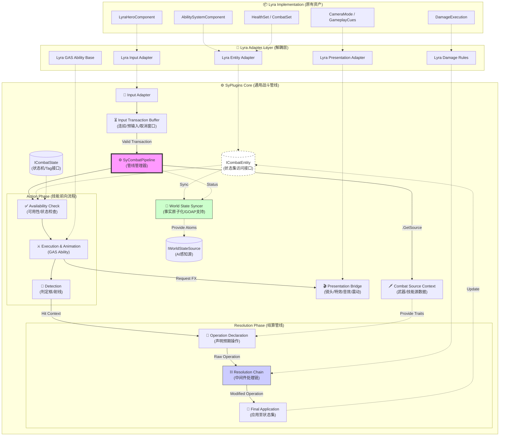

# SyCombat Pipeline Architecture (SCPA) & Lyra Refactoring Analysis
# SyPlugins 战斗管线架构设计与 Lyra 重构分析

本文档整合了 ARPG 需求分析与具体的管线架构设计，旨在指导 SyPlugins 在 Lyra 基础上的重构工作。

---

## 1. 核心设计理念

**“战斗操作系统”而非“战斗功能包”**

我们的目标是构建一套**标准化的、即插即用的战斗管线**，用于管理 ARPG 战斗中涉及的对象、流程及结算。

*   **从 Feature 转向 Flow**: 不定义具体的游戏机制（如“削韧”），而是定义数据的流转过程。
*   **从 Hardcode 转向 Declaration**: 技能不直接修改属性，而是**声明**对目标状态集的预期操作，由管线统一处理。
*   **接口即插座**: 所有模块通过 Interface 接入，Lyra 仅作为一种具体的底层实现。

---

## 2. 架构概览 (SCPA)

架构分为三层：**SyPlugins Core (管线层)**、**Adapter Layer (适配层)**、**Implementation Layer (实现层)**。

### 2.1 核心架构图



---

## 3. 核心子模块详解 (标准化的部分)

### 3.1 实体与状态 (Entity & State)
**目标**: 解耦具体的 Character 类和 AttributeSet，支持任意具备状态的对象。

*   **`ICombatEntityInterface`**:
    *   `GetStatusContainer()`: 获取状态容器（Map 或 GAS ASC 封装）。
    *   `GetCombatTags()`: 获取战斗标签（晕眩、无敌）。
    *   `GetTargetingPoint(GameplayTag BoneTag)`: 获取多部位判定点。
*   **Case**: 角色拥有多个状态集（Health, Poise, Elemental）。技能不直接 Cast 角色，而是通过接口请求操作。

### 3.2 管线中枢 (SyCombatPipelineComponent)
**目标**: 收口所有流程，管理生命周期。

*   **职责**:
    1.  接收 `RequestAction` (来自 InputBuffer 或 AI)。
    2.  调度 `SyCombatAction` (技能) 的执行。
    3.  接收 `ReportHit` (来自技能判定)。
    4.  启动 `ResolutionChain` (结算)。

### 3.3 战斗操作协议 (SyCombatOperation)
**目标**: 声明式的交互数据包。

*   **数据结构**:
    ```cpp
    struct FSyCombatOperation {
        AActor* Instigator;
        AActor* Target;
        const USyCombatSource* SourceContext; // 武器/技能源
        // 声明操作：Key=标识符(Health, Poise), Value=变化量
        TMap<FGameplayTag, float> Modifiers; 
        // 上下文标签：(Effect.Stun, Damage.Fire)
        FGameplayTagContainer ContextTags;
    };
    ```

### 3.4 结算链 (Resolution Chain)
**目标**: 中间件模式的数值处理，支持逻辑扩展。

*   **工作流**: `Raw Operation` -> `Processor A` -> `Processor B` -> `Final Operation`。
*   **Processor 示例**:
    *   **Defense Processor**: 检查目标格挡状态，修正数值。
    *   **Element Processor**: 检查抗性，计算元素反应。
    *   **Poise Processor (插件)**: 魂系专用，独立计算削韧，触发硬直 Tag。

### 3.5 智能输入缓冲 (Input Transaction Buffer)
**目标**: 解决 ARPG 手感核心的“预输入(Queueing)”与“取消(Canceling)”问题，而非单纯的输入拦截。

*   **职责**:
    *   **Transaction Lifecycle**: 将用户的按键行为封装为 `InputTransaction`，具有生命周期（有效期 0.X 秒）。
    *   **Conditional Consumption**: 监听 Pipeline 的 `CanAcceptInput` 信号（通常由 NotifyState 驱动）。只有在“可取消窗口(Cancel Window)”内才消费缓存的输入。
    *   **Input Priority**: 处理高优先级输入（如闪避）打断低优先级输入（如攻击）。

### 3.6 表现桥接 (Presentation Bridge)
**目标**: 将视觉/听觉反馈从逻辑代码中剥离，支持不同风格的实现（Lyra原生 or 其它）。

*   **设计**: 基于 **Tag-Driven Event** 的广播系统。
*   **接口**: `BroadcastPresentationEvent(GameplayTag EventTag, FVector ContextLocation, AActor* Source)`
*   **Case**:
    *   技能逻辑仅广播 `Event.Combat.Hit.Heavy`。
    *   表现层监听该 Tag，根据配置触发：`CameraShake_Heavy` + `Sound_Impact_Bass` + `VFX_Spark_Large`。
    *   *优势*: 可以在不修改技能蓝图的情况下，通过覆写表现层的 DataAsset 彻底改变打击感。

### 3.7 AI 世界状态同步器 (World State Syncer)
**目标**: 为 GOAP/HTN 等高级 AI 系统提供标准化的“事实(Fact)”来源，保持 AI 感知的原子化。

*   **职责**: 将复杂的战斗数据转化为原子化的 `WorldState` (Key-Value/Boolean)，供 AI Planner 使用。
*   **数据流**:
    *   **Source**: 监听 `SyCombatPipeline` (当前动作、冷却) 和 `ICombatEntity` (血量、Buff)。
    *   **Output**: 维护一份轻量级状态表，例如：
        *   `Target.Distance = 350.0`
        *   `Self.HasStatus.Stun = False`
        *   `Self.Ability.Ult.Ready = True`
        *   `World.DangerLevel = High`
*   **Integration**: AI 决策系统不需要直接 Query 复杂的 Gameplay 对象，而是直接订阅或读取这个原子化的 Fact Sheet。

### 3.8 战斗源上下文 (Combat Source Context)
**目标**: 明确“是谁，用什么”发起了攻击，解决多武器/多姿态切换的数据来源问题。

*   **概念**: 任何战斗行为都必须关联一个 `CombatSource` (如：主手武器实例、环境陷阱实例、空手姿态)。
*   **功能**:
    *   提供 **Trait Tags** (如 `Weapon.Type.Axe`, `Element.Fire`) 供管线查询。
    *   提供 **Attribute Modifiers** (武器攻击力、削韧值) 供 `Operation Builder` 构建基础伤害包。
    *   *解耦*: 技能蓝图不再 hardcode 伤害值，而是调用 `Source->GetBaseDamage()`。

---

## 4. Lyra 重构与适配路径

### 4.1 Phase 1: 基础设施 (2周)
建立接口层，切断直接依赖。
*   [ ] 定义 `ICombatEntityInterface`，让 `LyraCharacter` 实现它。
*   [ ] 实现 `SyCombatPipelineComponent`，挂载到 Character。
*   [ ] 定义 `FSyCombatOperation` 和 `CombatSource` 结构体。

### 4.2 Phase 2: 意图与行动 (3周)
接管输入与技能流程。
*   [ ] **Input Buffer**: 实现支持预输入的缓冲层，在 `LyraHeroComponent` 中接入。
*   [ ] **Action Adapter**: 创建 `SyCombatAbility` 基类 (继承 GAS Ability)，接入 `Presentation Bridge`。
*   [ ] **World State**: 搭建基础的 `WorldStateSyncer`，先同步基础的血量和距离信息。

### 4.3 Phase 3: 结算与规则 (3周)
实现通用的数值管线。
*   [ ] **Resolution Chain**: 实现 Processors 管理机制。
*   [ ] **Lyra Rule Adapter**: 将 `LyraDamageExecution` 的逻辑封装为一个 Processor。

---

## 5. 核心差异对比：Lyra vs ARPG

| 维度 | Lyra (原生 FPS) | ARPG (目标) | SCPA 解决方案 |
| :--- | :--- | :--- | :--- |
| **流程控制** | 分散在 Ability/Weapon | 统一管线管理 | **SyCombatPipeline** + **Input Buffer** |
| **伤害逻辑** | 硬编码在 Execution | 可插拔规则 | **Resolution Chain** + Processors |
| **状态交互** | 单一 HealthSet | 多状态集 (HP/Poise) | **Operation Declaration** |
| **AI 决策** | Behavior Tree Service | GOAP/HTN | **World State Syncer** (Fact Atomization) |
| **表现反馈** | 耦合在 GameplayCue | 独立表现管线 | **Presentation Bridge** |

---

## 6. 进阶设计考量 (Gap Analysis)

在实现过程中需注意以下 ARPG 特有的系统需求：

1.  **全局时钟管理 (Time Dilation / Hitstop)**
    *   需要一个 `SyTimeManager` 来仲裁不同技能对时间流逝的修改请求（卡肉、子弹时间），防止冲突。
2.  **阵营与友伤 (Faction & Targeting)**
    *   在 Detection 阶段引入 `IFactionInterface`，支持复杂的敌我识别逻辑（如魅惑、中立阵营）。
3.  **网络同步策略 (Replication)**
    *   Input Buffer 和表现层需支持客户端预测 (Client-Side Prediction)，避免网络延迟导致手感粘滞。
4.  **碰撞体多部位 (Multipart Hitbox)**
    *   ICombatEntity 需支持返回具体部位（Bone/Socket），以便结算流程计算弱点伤害或部位破坏。
