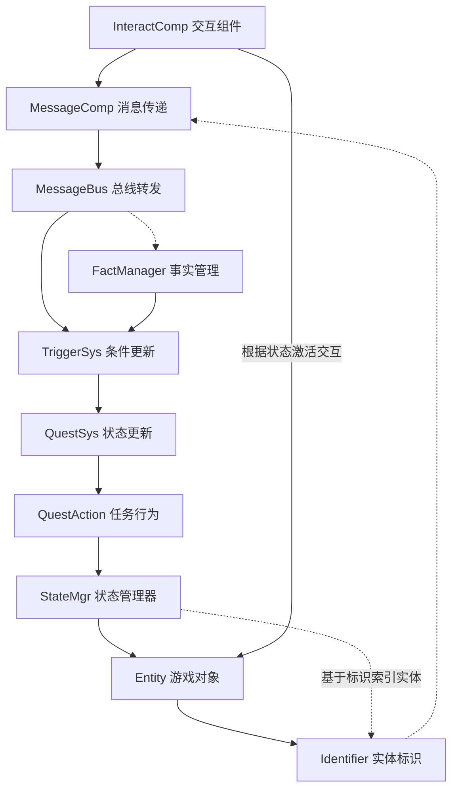

# SyPlugins - Unreal Engine 模块化插件系统

## 项目概述
SyPlugins 是一个为 Unreal Engine 开发的模块化插件系统，专注于构建一个以状态驱动为核心思想的游戏框架。系统辅以消息驱动和模块化设计，实现灵活且易扩展的游戏实体基础功能。

## 核心理念
- **状态驱动**: 基于 StateManager 统一管理游戏对象状态及其转换
- **消息驱动**: 使用 MessageBus 实现统一的交互和玩家行为感知（并通过Flow或其它插件进行流程管理）
- **组件化**: 采用组件式设计，提高代码复用性

## 系统架构

搭建该系统用于简要实现下述逻辑链条

## 插件层级
1. **SyCore**
   - 系统的基础设施模块
   - 提供实体唯一标识（Identifier）系统
   - 实现模块间通信的消息总线（MessageBus）
   - 定义部分核心数据结构
   - 作为所有其他SyPlugins模块的基础依赖

2. **SyStateCore**
   - 状态系统的核心定义模块
   - 定义实体状态的数据结构（FSyEntityState）
   - 提供状态初始化配置（FSyEntityInitData）
   - 定义各种状态元数据类（拓展UO_TagMetadata）
   - 提供状态数据的访问接口

3. **SyStateManager**
   - 状态管理的中心化模块
   - 提供状态变更记录和分发机制
   - 实现状态同步的权威来源
   - 管理状态变更记录（FSyStateModificationRecord）
   - 提供状态查询和事件通知

4. **SyOperation**
   - 状态操作定义模块
   - 定义状态变更操作的数据结构
   - 提供参数Schema系统
   - 实现常用参数结构体
   - 支持编辑器配置和验证

5. **SyEntity**
   - 通用实体框架模块
   - 提供基于组件的实体管理框架
   - 实现实体状态管理（通过SyStateComponent）
   - 支持非侵入式的Actor扩展
   - 提供实体注册和查询功能

6. **SyFlowImpl**
   - Flow插件实现模块
   - 提供SyPlugins功能的图形化节点
   - 实现消息系统的Flow节点集成
   - 支持实体控制的Flow节点（计划中）
   - 使SyPlugins功能更易于组合和使用

7. **SyPluginsImpl**
   - 插件实现示例模块
   - 对示例使用的GameplayTag结构等进行汇总
   - 提供具体功能实现参考
   - 展示模块间的集成方式

8. **SyQuest**（计划中）
   - 任务系统实现
   - 基于状态和条件驱动的任务更新
   - 依赖于SyCore和SyEntity模块
   - 提供任务逻辑和状态管理

9. **SyGameplay**（计划中）
   - 游戏玩法框架
   - 构建在SyEntity之上的具体游戏系统
   - 提供实体交互等高层功能
   - 实现具体的游戏机制

## 关键特性
- **状态管理系统**: 统一的状态转换和管理机制
- **消息总线**: 灵活的模块间通信
- **实体与组件**: 可扩展的游戏对象架构
- **任务系统**: 条件驱动的任务更新机制

## 技术规范

### 命名约定
- 类前缀: `Sy`
- 接口前缀: `ISy`
- 枚举前缀: `ESy`
- 结构体前缀: `FSy`

### 开发规范
- 遵循 Unreal Engine 编码标准
- 使用 UPROPERTY 和 UFUNCTION 确保反射
- 所有公共 API 必须有完整文档
- 关键功能需要单元测试覆盖

## 模块依赖
- 严格遵循依赖方向：Quest → Gameplay/Entity → Core
- 通过接口和消息总线实现模块间通信
- 避免循环依赖
