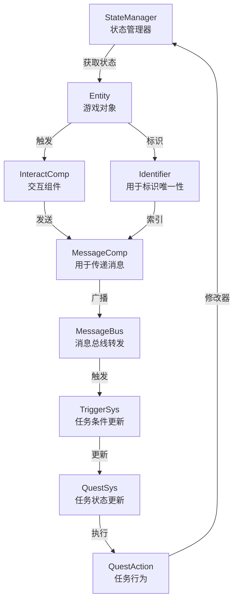

# SyPlugins - Unreal Engine 模块化插件系统

## 项目概述
SyPlugins 是一个为 Unreal Engine 开发的模块化插件系统，专注于构建一个以状态驱动的游戏框架。系统采用消息驱动架构，通过高内聚低耦合的模块设计，实现灵活且可扩展的游戏功能开发框架。

## 核心理念
- **状态驱动**: 通过 StateManager 统一管理游戏对象状态转换
- **消息驱动**: 使用 MessageBus 实现模块间的解耦通信
- **组件化**: 采用组件式设计，提高代码复用性
- **可扩展**: 模块间通过接口和消息通信，易于扩展新功能

## 系统架构

## 插件层级
1. **SyCore**
   - 核心功能模块集合
   - 包含基础设施、状态管理、消息系统等
   - 详见 [SyCore/README.md](SyCore/README.md)

2. **SyGameplayFramework**
   - 游戏玩法框架
   - 构建在 SyCore 之上的游戏系统
   - 提供实体、交互等高层功能

3. **SyQuestSystem**
   - 任务系统实现（待确定是否制作及制作形式）
   - 依赖于前两个模块
   - 处理任务逻辑和状态

## 关键特性
- **状态管理系统**: 统一的状态转换和管理机制
- **消息总线**: 灵活的模块间通信
- **实体组件**: 可扩展的游戏对象架构
- **任务触发系统**: 条件驱动的任务更新机制

## 技术规范

### 命名约定
- 类前缀: `Sy`
- 接口前缀: `ISy`
- 枚举前缀: `ESy`
- 结构体前缀: `FSy`

### 开发规范
- 遵循 Unreal Engine 编码标准
- 使用 UPROPERTY 和 UFUNCTION 确保反射
- 所有公共 API 必须有完整文档
- 关键功能需要单元测试覆盖

## 模块依赖
- 严格遵循依赖方向：QuestSystem → GameplayFramework → Core
- 通过接口和消息总线实现模块间通信
- 避免循环依赖
