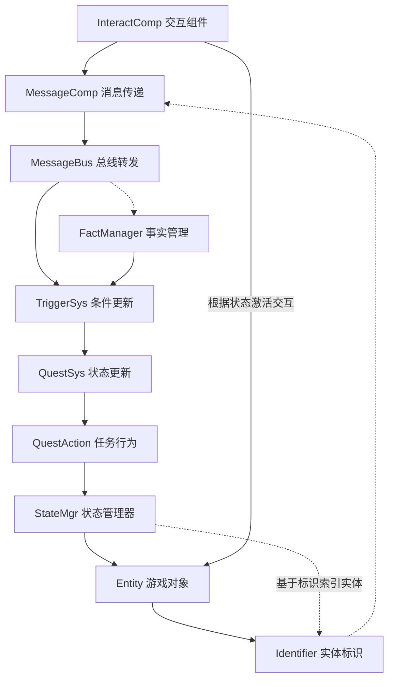

# SyPlugins - Unreal Engine 模块化插件系统

## 项目概述
SyPlugins 是一个为 Unreal Engine 开发的模块化插件系统，专注于构建一个以状态驱动为核心思想的游戏框架。系统辅以消息驱动和模块化设计，实现灵活且易扩展的游戏实体基础功能。

## 核心理念
- **状态驱动**: 基于 StateManager 统一管理游戏对象状态及其转换
- **消息驱动**: 使用 MessageBus 实现统一的交互和玩家行为感知（并通过Flow或其它插件进行流程管理）
- **组件化**: 采用组件式设计，提高代码复用性

## 系统架构

搭建该系统用于简要实现下述逻辑链条

## 插件层级
1. **SyCore**
   - 核心功能模块集合
   - 包含基础设施、Id系统、消息系统等
   - 详见 [SyCore/README.md](SyCore/README.md)

2. **SyEntity/SyGameplay**
   - 游戏玩法框架
   - 构建在 SyCore 之上的游戏系统
   - 提供实体、交互等高层功能

3. **SyFlowImpl**

   - 通过拓展Flow插件实现对流程的基本管理
   - 其它核心模块的参考串联方案

4. **SyQuest**
   - 任务系统实现（待确定是否制作及制作形式）
   - 依赖于前两组模块
   - 处理任务逻辑和状态

## 关键特性
- **状态管理系统**: 统一的状态转换和管理机制
- **消息总线**: 灵活的模块间通信
- **实体与组件**: 可扩展的游戏对象架构
- **任务系统**: 条件驱动的任务更新机制

## 技术规范

### 命名约定
- 类前缀: `Sy`
- 接口前缀: `ISy`
- 枚举前缀: `ESy`
- 结构体前缀: `FSy`

### 开发规范
- 遵循 Unreal Engine 编码标准
- 使用 UPROPERTY 和 UFUNCTION 确保反射
- 所有公共 API 必须有完整文档
- 关键功能需要单元测试覆盖

## 模块依赖
- 严格遵循依赖方向：Quest → Gameplay/Entity → Core
- 通过接口和消息总线实现模块间通信
- 避免循环依赖
